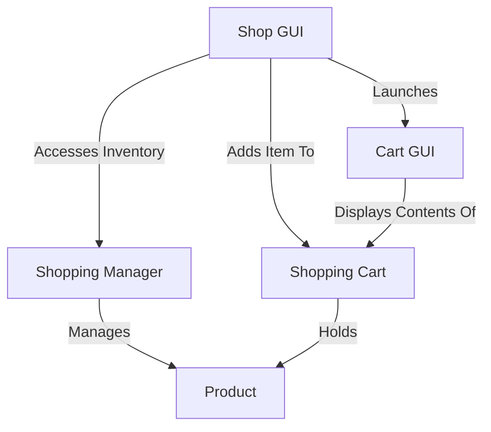
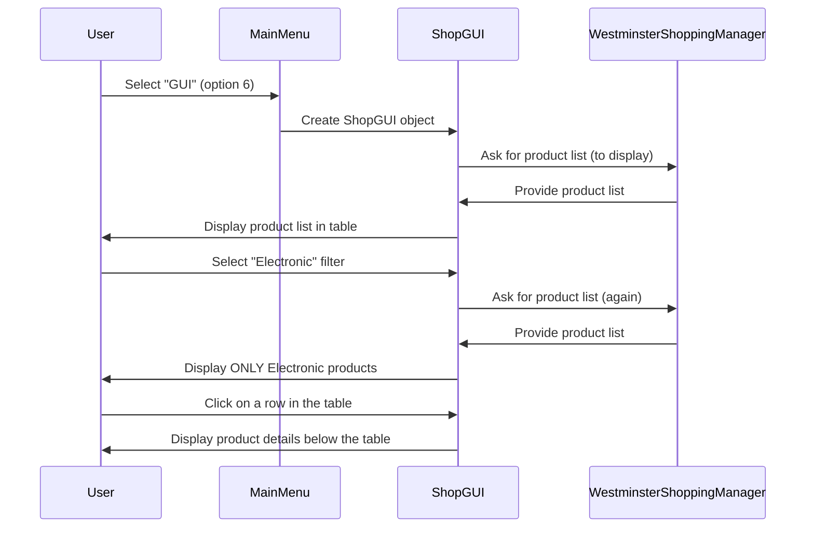
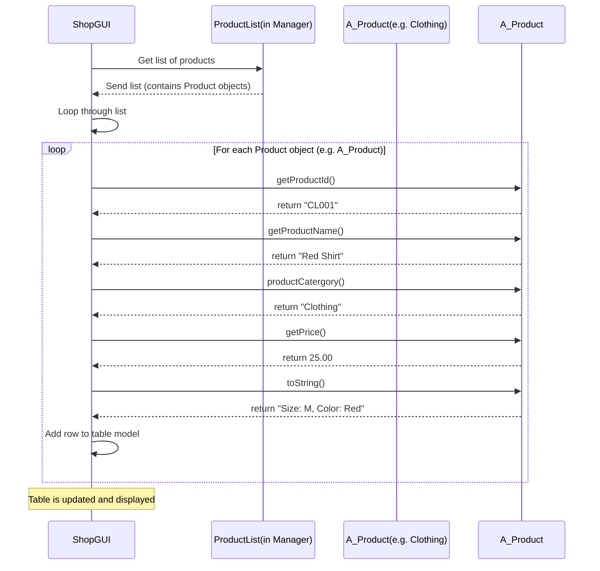
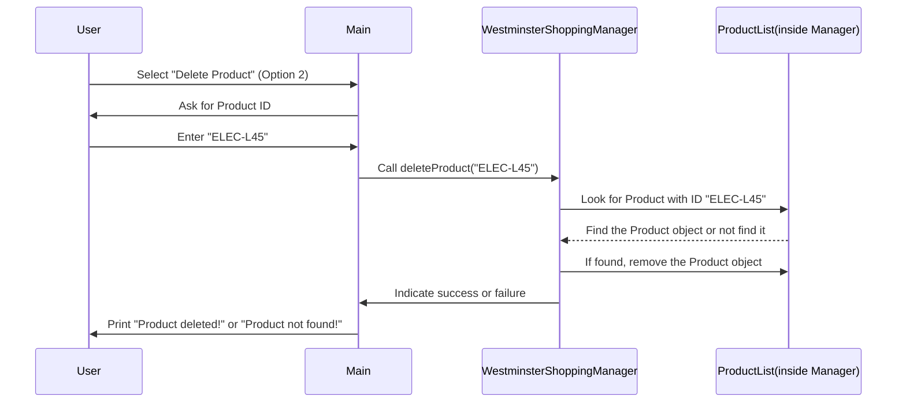
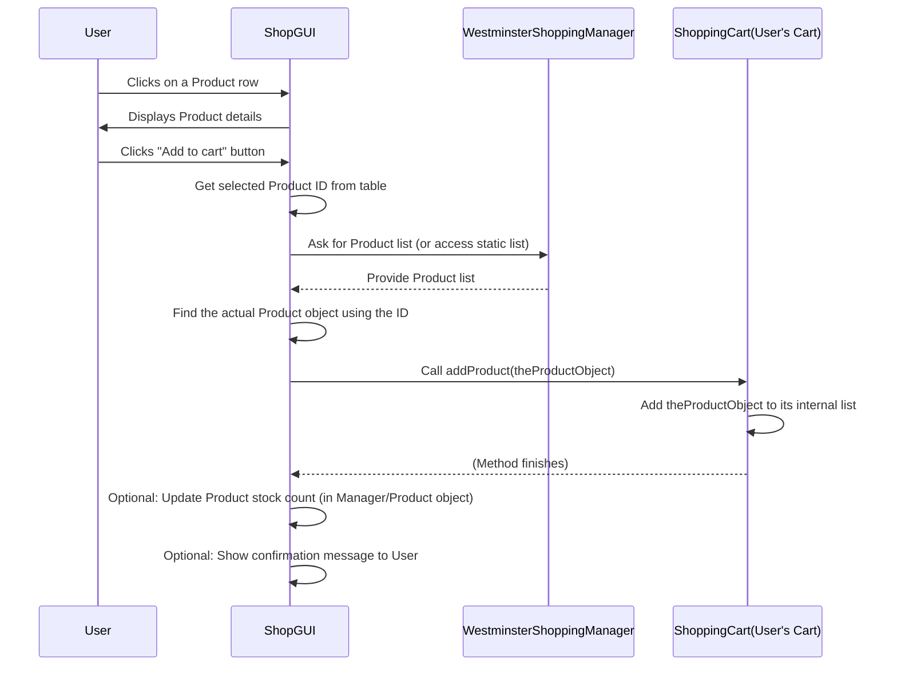
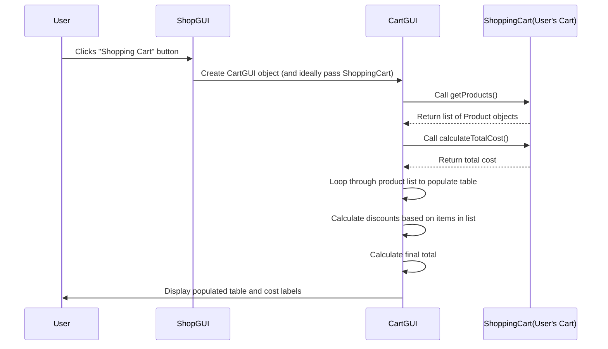

# Tutorial: Online-Shopping-System

This project simulates an *Online Shopping System*. It includes a **Shopping Manager** to handle the inventory of **Products**, such as clothing and electronics. Customers can browse these products using a **Shop GUI**, add them to a virtual **Shopping Cart**, and review their selected items and total cost via a **Cart GUI**.


## Visual Overview



## Chapters

1. [Shop GUI
](01_shop_gui_.md)
2. [Product
](02_product_.md)
3. [Shopping Manager
](03_shopping_manager_.md)
4. [Shopping Cart
](04_shopping_cart_.md)
5. [Cart GUI
](05_cart_gui_.md)

---

<sub><sup>Generated by [AI Codebase Knowledge Builder](https://github.com/The-Pocket/Tutorial-Codebase-Knowledge).</sup></sub>

# Chapter 1: Shop GUI

Welcome to the first chapter of our journey into the Online Shopping System! Think of this chapter as opening the front door and stepping into the virtual store.

## What is the Shop GUI?

In any online shop, you need a way for customers to see what's for sale. That's exactly what the **Shop GUI** (Graphical User Interface) does. It's the visual part of the system that customers interact with.

Imagine walking into a physical store. You see shelves stocked with products, signs telling you which aisle is for electronics or clothing, and maybe displays showing details about a specific item. The Shop GUI is the online version of this. It's the virtual storefront and aisles where customers browse and choose what they want to buy.

**Why do we need a GUI?** While the system could work using text commands, a graphical interface is much easier and more pleasant for people to use. It makes shopping feel more natural, like pointing and clicking instead of typing instructions.

## Our Goal for This Chapter

By the end of this chapter, you'll understand:
*   What the main parts of the Shop GUI are.
*   How the GUI displays products to the customer.
*   How the GUI allows customers to see product details.
*   Where the Shop GUI fits into the overall system.

## How a Customer Uses the Shop GUI (The Use Case)

Let's think about what a customer wants to do:

1.  See what products are available.
2.  Maybe filter the list to only see electronics or clothing.
3.  Click on a product they are interested in to see more details.
4.  Decide to add the product to their shopping cart.

The Shop GUI is designed to make these steps easy.

## Exploring the Shop GUI's Look

Let's look at the main parts you might see in the Shop GUI window:

*   **Product Table:** This is like the shelves in the store. It lists all the products available with key information like ID, Name, Type (Electronic or Clothing), and Price.
*   **Category Filter:** This is like the signs above the aisles. It lets the customer choose to see *only* Electronic products, *only* Clothing products, or "All" products.
*   **Product Details Area:** When a customer clicks on a product in the table, this area below shows more information about that specific item (like brand and warranty for electronics, or size and color for clothing).
*   **Buttons:**
    *   **Shopping Cart Button:** This is like heading to the checkout counter. It will take the customer to their shopping cart (we'll learn about the [Shopping Cart](04_shopping_cart_.md) and [Cart GUI](05_cart_gui_.md) in later chapters).
    *   **Add to Cart Button:** This is like putting an item in your physical cart. It adds the currently selected product from the table to the customer's [Shopping Cart](04_shopping_cart_.md).

## How to Start the Shop GUI

In our project, the Shop GUI is launched from the main menu you see when you run the application.

Look at the `Main.java` code:

```java
// ... other imports and code ...

public class Main {
    public static void main(String[] args) {
        // ... shoppingManager setup and menu loop ...

        switch (choice) {
            // ... cases 1 through 5 ...
            case 6:
                System.out.print("GUI"); // Prints "GUI" to console
                ShopGUI g1 = new ShopGUI(); // <-- This line creates the GUI window
                g1.updateTableData();      // <-- This line tells the GUI to show products
                break;
            // ... case 0 and default ...
        }
    }
}
```

When the user enters `6` in the console menu, the code creates a `ShopGUI` object (`new ShopGUI()`). This makes the graphical window appear on the screen. Then, `g1.updateTableData()` is called to load the current list of products into the GUI's table so the customer can see them.

## What Happens Under the Hood? (Simplified)

When you start the GUI or interact with it, here's a simple flow:



This diagram shows that the GUI acts as a bridge between the customer (User) and the data holder (`WestminsterShoppingManager`). When the GUI needs to show product information, it asks the `WestminsterShoppingManager` for the list. It then takes that list and puts it into the visual table for the user to see. When the user interacts (like selecting a filter or a product), the GUI reacts by updating what it shows.

## Looking at the Code (`ShopGUI.java`)

Let's peek inside the `ShopGUI.java` file to see how these parts are built.

```java
// ... imports ...

public class ShopGUI implements ActionListener {
    JFrame frame;         // The main window
    JTable table;         // The table to show products
    JLabel label;         // A text label
    JButton shoppingCart; // Button for the cart
    JButton addToCart;    // Button to add to cart
    JComboBox<String> productType; // Dropdown for filtering
    DefaultTableModel model;       // Helps manage data in the table
    DefaultListModel<String> productInfo; // Manages data for product details list
    JScrollPane scrollPane; // Makes the table scrollable

    public ShopGUI() {
        frame = new JFrame("Westminster Shopping Manager"); // Create the window
        frame.setLayout(null); // We place things manually
        frame.setDefaultCloseOperation(JFrame.EXIT_ON_CLOSE); // What happens when you close it

        // Create and position buttons, labels, dropdown
        shoppingCart = new JButton("Shopping Cart");
        shoppingCart.setBounds(450, 5, 200, 50); // x, y, width, height
        frame.add(shoppingCart);

        label = new JLabel("Select Product Category");
        label.setBounds(50, 70, 250, 50);
        frame.add(label);

        productType = new JComboBox<>(new String[]{"All", "Electronic", "Clothing"});
        productType.setBounds(250, 70, 200, 50);
        productType.addActionListener(this); // Make it react when selection changes
        frame.add(productType);

        // Setup the table
        model = new DefaultTableModel(new String[]{"Product_id", "Name", "Type", "Price", "Info"}, 0); // Define columns
        table = new JTable(model);
        scrollPane = new JScrollPane(table); // Put table in a scrollable area
        scrollPane.setBounds(70, 130, 700, 240);
        frame.add(scrollPane);

        // Setup product details area (uses a JList with a DefaultListModel)
        productInfo = new DefaultListModel<>(); // Model to hold detail lines
        JList<String> list = new JList<>(productInfo); // The list component
        list.setBounds(70, 380, 700, 252);
        frame.add(list);

        // Setup Add to Cart button
        addToCart = new JButton("Add to cart");
        addToCart.setBounds(250, 640, 150, 50);
        addToCart.addActionListener(this); // Make it react when clicked
        frame.add(addToCart);

        // ... table selection listener setup (explained next) ...

        frame.setSize(800, 850); // Set window size
        frame.setResizable(false); // Don't allow resizing
        frame.setVisible(true); // Show the window
    }
    // ... rest of the class ...
}
```

This part of the code, inside the `ShopGUI()` constructor, is like the architect designing the layout and placing all the furniture (buttons, tables, etc.) in the window (`JFrame`). It uses components from Java's Swing library (like `JButton`, `JTable`, `JComboBox`).

### Populating the Table

The table needs data! The `updateTableData()` method is responsible for getting the list of products and putting them into the table's model (`DefaultTableModel`).

```java
// Inside ShopGUI.java

public void updateTableData() {
    model.setRowCount(0); // Clear existing rows
    // Loop through the list of products (from WestminsterShoppingManager)
    for (Product product : WestminsterShoppingManager.productList) {
        model.addRow(new Object[]{ // Add a new row for each product
                product.getProductId(),
                product.getProductName(),
                product.productCatergory(),
                product.getPrice(),
                product.toString() // A string representation of product info
        });
    }
}

private void filterTableData(String selectedType) {
    model.setRowCount(0); // Clear table

    // Loop through ALL products
    for (Product product : WestminsterShoppingManager.productList) {
        // Check if the product matches the selected type OR if "All" is selected
        if (selectedType.equalsIgnoreCase("All") || selectedType.equalsIgnoreCase(product.productCatergory())) {
            // Add the product to the table model if it matches
            model.addRow(new Object[]{
                    product.getProductId(),
                    product.getProductName(),
                    product.productCatergory(),
                    product.getPrice(),
                    product.toString()
            });
        }
    }
}
```

The `updateTableData` method simply adds *all* products from the `WestminsterShoppingManager.productList` into the table model. The `filterTableData` method does the same but only adds products that match the category selected in the dropdown. Notice they both get product data from `WestminsterShoppingManager.productList`. This list is where all the products are stored. We will learn more about what a [Product](02_product_.md) is in the next chapter!

### Handling User Actions

When the user clicks a button or selects something from the dropdown, the code needs to react. This is handled by the `actionPerformed` method and a special `ListSelectionListener`.

```java
// Inside ShopGUI.java

@Override
public void actionPerformed(ActionEvent e) {
    if (e.getSource() == shoppingCart) {
        frame.dispose(); // Close the current Shop GUI window
        // We would open the Cart GUI here later
    }
    if (e.getSource() == productType) {
        String selectedType = (String) productType.getSelectedItem();
        filterTableData(selectedType); // Call the method to filter the table
    }
    if (e.getSource() == addToCart) {
        int selectedRow = table.getSelectedRow(); // Get which row is selected
        if (selectedRow != -1) { // If a row IS selected
            // Code to add the selected product to the cart would go here
            // (This part is not fully implemented in the provided snippet yet)
        } else {
            // Show a message if no row was selected
            JOptionPane.showMessageDialog(frame, "Please select a row from the table.");
        }
    }
}

// Inner class specifically for handling table row clicks
private class TableSelectionListener implements ListSelectionListener {
    @Override
    public void valueChanged(ListSelectionEvent e) {
        if (!e.getValueIsAdjusting()) { // Check if selection has finished changing
            int selectedRow = table.getSelectedRow(); // Get the selected row index
            if (selectedRow != -1) { // If a row is selected
                productInfo.clear(); // Clear old details

                // Get data from the selected row in the table model
                String productId = table.getValueAt(selectedRow, 0).toString();
                String productName = table.getValueAt(selectedRow, 1).toString();
                String productType = table.getValueAt(selectedRow, 2).toString();
                String price = table.getValueAt(selectedRow, 3).toString();
                // The last column ("Info") contains the special details string
                String productInfoText = table.getValueAt(selectedRow, 4).toString();

                // Add these details to the productInfo model (which is displayed by the JList)
                productInfo.addElement("Product Details");
                productInfo.addElement("Product ID :      " + productId);
                productInfo.addElement("Product Category: " + productType);
                productInfo.addElement("Name:             " + productName);
                productInfo.addElement("Price:            " + price);
                productInfo.addElement("Info:             " + productInfoText);
            }
        }
    }
}
```

The `actionPerformed` method is triggered by buttons and the dropdown. It checks which component triggered the event (`e.getSource()`) and performs the corresponding action (closing the window, filtering the table, or getting the selected row).

The `TableSelectionListener` is a separate piece of code that "listens" specifically for clicks on the rows of the `JTable`. When a row is clicked (`valueChanged` method is called), it gets the data from that row using `table.getValueAt()` and updates the `productInfo` list model, which causes the product details to appear below the table.

## Conclusion

In this chapter, we've met the **Shop GUI**, the customer-facing window of our Online Shopping System. We learned that it displays products in a table, allows filtering by category, shows details when a product is selected, and has buttons for the shopping cart and adding items. We saw how it's created and launched from the `Main` class and how it gets product data from the `WestminsterShoppingManager`.

The Shop GUI's main job is to visually present products. But what exactly *is* a product? How is it represented in our code? That's what we'll explore in the next chapter.

[Next Chapter: Product](02_product_.md)

---

<sub><sup>Generated by [AI Codebase Knowledge Builder](https://github.com/The-Pocket/Tutorial-Codebase-Knowledge).</sup></sub> <sub><sup>**References**: [[1]](https://github.com/Sehandu-Siriwardhana/Online-Shopping-System/blob/4156d06f82863cf11bdd4c8154ee1379df78b7db/src/Main.java), [[2]](https://github.com/Sehandu-Siriwardhana/Online-Shopping-System/blob/4156d06f82863cf11bdd4c8154ee1379df78b7db/src/ShopGUI.java)</sup></sub>

# Chapter 2: Product

Welcome back to our online shopping system journey! In [Chapter 1: Shop GUI](01_shop_gui_.md), we saw the friendly face of our store – the window where customers browse. We learned how the GUI displays items and lets you filter them. But what *are* these items? How do we represent a T-shirt, a laptop, or a pair of shoes within our system?

That's where the **Product** concept comes in!

## What is a Product?

Imagine a real store. Every item on the shelf has a label with basic information: its name, a unique identifier (like a barcode), and its price. In our online system, a **Product** is the digital version of this label. It's the fundamental building block that represents anything you can buy in the store.

Think of it as a blueprint or a template for an item. Every item in the store, whether it's a piece of clothing or an electronic gadget, starts with this basic `Product` blueprint.

## Why Do We Need a Product Concept?

If we were *only* selling T-shirts, we could just have a "T-shirt" blueprint. But an online store sells many different kinds of things! We need a standard way to handle the information common to *all* items, like:

*   A unique way to identify it (like an ID).
*   What it's called (its name).
*   How much it costs (its price).
*   How many we have in stock (available items).

Having a `Product` concept allows us to treat all items the same for these basic things. The GUI in Chapter 1 could show a list of "Products" because they all share these common details.

## Common Information for All Products

Let's look at the basic details every item needs:

| Detail        | Description                               | Example   |
| :------------ | :---------------------------------------- | :-------- |
| **Product ID**| A unique code to identify this specific item | "P001", "ELEC-L45" |
| **Product Name**| The name of the item                     | "Blue T-Shirt", "Gaming Laptop" |
| **Available Items**| How many of this item we have in stock   | 50, 12    |
| **Price**     | How much it costs                         | 15.99, 1200.00 |

These are the essential pieces of information that the `Product` concept holds.

## Different Types of Products

Now, while all products share basic info, they also have unique characteristics. A T-shirt has a size and color, but a laptop has a brand and warranty period.

Our `Product` concept needs to be flexible enough to handle these differences. We do this by having specific types of products that *extend* or *inherit* from the basic `Product`. In our system, we have two specific types:

1.  **Clothing:** Adds details like `size` and `color`.
2.  **Electronics:** Adds details like `brand` and `warranty period` (in months).

This is like starting with a generic item label and then adding extra, specific tags depending on whether the item is clothing or electronics.

## Looking at the Product Code (`Product.java`)

Let's peek at the `Product.java` file. This is the blueprint for the *general* product.

```java
// File: src/Product.java

import java.io.Serializable; // Needed for saving products later

// abstract means you can't create a direct 'Product' object,
// only specific types like Clothing or Electronics
public abstract class Product implements Comparable<Product>{
    // Common details for ALL products
    private String productId;
    private String productName;
    private int availableItems;
    private double price; // Moved price here, as it's common

    // Constructor: Called when you create a NEW Product object
    public Product(String productId, String productName, int availableItems, double price) {
        this.productId = productId;
        this.productName = productName;
        this.availableItems = availableItems;
        this.price = price;
    }

    // Methods to get the common details (Getters)
    public String getProductId() {
        return productId;
    }

    public String getProductName() {
        return productName;
    }

    public int getAvailableItems() {
        return availableItems;
    }

    public double getPrice() {
        return price;
    }

    // Method to change available items (Setter)
    public void setAvailableItems(int availableItems) {
        this.availableItems = availableItems;
    }

    // This method MUST be provided by the specific product types (Clothing/Electronics)
    public abstract String productCatergory();

    // Method to compare products (not essential for THIS chapter, useful later)
    @Override
    public int compareTo(Product otherProduct) {
        return this.productName.compareTo(otherProduct.productName);
    }

    // How the product should look as a string (useful for printing/display)
    // Note: The specific types (Clothing/Electronics) will OVERRIDE this for details
    @Override
    public String toString() {
        return "Product{" + // This toString might not be used directly if subclasses override
                "productId='" + productId + '\'' +
                ", productName='" + productName + '\'' +
                ", price=" + price +
                '}';
    }

    // Note: There was some duplicate/conflicting code in the provided Product.java snippet.
    // I've simplified it to have one set of common attributes and one constructor.
    // The 'id', 'name', 'price' attributes and the second constructor were removed for clarity
    // and consistency with the Clothing/Electronics subclasses.
}
```
*(Note: The original provided `Product.java` snippet had some duplicate attributes and constructors. I've shown a simplified version above that is consistent with the `Clothing` and `Electronics` subclasses provided, keeping only one set of `productId`, `productName`, `availableItems`, and `price`)*

In this code:
*   `abstract` means you can't just create a generic `Product`. You have to create a `Clothing` or `Electronics` product.
*   It defines the common fields (`productId`, `productName`, `availableItems`, `price`) and methods to access them (getters) or modify them (setters).
*   `abstract String productCatergory();` means that any specific type (like `Clothing` or `Electronics`) *must* provide its own way of telling us its category (e.g., "Clothing" or "Electronic"). This is important for filtering in the GUI.
*   The `toString()` method is a standard way to get a text description of an object. The specific types will use this to provide their unique details (like size/color or brand/warranty) that were shown in the GUI's details area in Chapter 1.

## Looking at the Specific Product Types (`Clothing.java`, `Electronics.java`)

Now let's see how `Clothing` and `Electronics` add their specific features.

```java
// File: src/Clothing.java

// 'extends Product' means Clothing IS A type of Product
public class Clothing extends Product {
    // Specific details for Clothing
    private int size;
    private String color;

    // Constructor for Clothing
    // It calls the Product constructor first (using super(...))
    // then sets its own specific details.
    public Clothing(String productId, String productName, int availableItems, double price, int size, String color) {
        super(productId, productName, availableItems, price); // Calls the Product constructor
        this.size = size;
        this.color = color;
    }

    // Getters and setters for Clothing specific attributes
    public int getSize() { return size; }
    public void setSize(int size) { this.size = size; }
    public String getColor() { return color; }
    public void setColor(String color) { this.color = color; }

    // This provides the category, as required by the abstract method in Product
    public String productCatergory(){
        return "Clothing";
    }

    // This overrides the Product toString() to include Clothing-specific details
    @Override
    public String toString() {
        // Combines basic info (from Product) with specific info
        return "Size: " + size + ", Color: " + color;
    }
}
```

```java
// File: src/Electronics.java

// 'extends Product' means Electronics IS A type of Product
public class Electronics extends Product {
    // Specific details for Electronics
    private String brand;
    private int warrantyPeriod; // in months

    // Constructor for Electronics
    // It calls the Product constructor first (using super(...))
    // then sets its own specific details.
    public Electronics(String productId, String productName, int availableItems, double price, String brand, int warrantyPeriod) {
        super(productId, productName, availableItems, price); // Calls the Product constructor
        this.brand = brand;
        this.warrantyPeriod = warrantyPeriod;
    }

    // Getters and setters for Electronics specific attributes
    public String getBrand() { return brand; }
    public void setBrand(String brand) { this.brand = brand; }
    public int getWarrantyPeriod() { return warrantyPeriod; }
    public void setWarrantyPeriod(int warrantyPeriod) { this.warrantyPeriod = warrantyPeriod; }

    // This provides the category, as required by the abstract method in Product
    public String productCatergory(){
        return "Electronic";
    }

    // This overrides the Product toString() to include Electronics-specific details
    @Override
    public String toString() {
        // Combines basic info (from Product) with specific info
        return "Brand: " + brand + ", Warranty: " + warrantyPeriod + " months";
    }
}
```

Key points here:
*   `extends Product` is the magic word that links `Clothing` and `Electronics` back to the general `Product` concept. They inherit all the common parts (like ID, Name, Price, Available Items).
*   Each specific class has its *own* unique attributes (`size`, `color` for `Clothing`; `brand`, `warrantyPeriod` for `Electronics`).
*   The `super(productId, productName, availableItems, price);` line in the constructor is crucial. It tells the computer to first build the "Product" part of the object using the common details provided.
*   They *must* implement the `productCatergory()` method because it was marked `abstract` in the `Product` class.
*   They *override* the `toString()` method to provide the specific details that the GUI displays in the details area or the "Info" column of the table (as seen in [Chapter 1: Shop GUI](01_shop_gui_.md)).

## How the GUI Uses Products (Revisiting Chapter 1)

Now that we understand what a `Product` is, let's quickly connect it back to [Chapter 1: Shop GUI](01_shop_gui_.md).

When the `ShopGUI` needs to display products, it gets a list from the `WestminsterShoppingManager`. This list contains objects that are *either* `Clothing` or `Electronics`, but the GUI can treat them generally as `Product` objects because of inheritance.



As you can see, the GUI doesn't need to know if an item is `Clothing` or `Electronics` to get its ID, Name, Category, or Price because these methods are defined in the common `Product` class (or `productCatergory` is *required* by it). When the GUI calls `toString()`, the correct version from `Clothing` or `Electronics` is automatically used, providing the specific details needed for the "Info" column or the details area.

## Conclusion

In this chapter, we've gone behind the scenes to understand the core concept of a **Product**. We learned that it provides the basic information shared by all items in the store (ID, Name, Price, Availability) and that specific types like `Clothing` and `Electronics` extend `Product` to add their unique details. We saw how the code for `Product`, `Clothing`, and `Electronics` is structured using inheritance and how the `ShopGUI` relies on the methods defined in these classes to display product information.

Now that we know what a Product is, how does the system *manage* all these products? How are they added, deleted, and stored? That's the job of the **Shopping Manager**, which we will explore in the next chapter.

[Next Chapter: Shopping Manager](03_shopping_manager_.md)

---

<sub><sup>Generated by [AI Codebase Knowledge Builder](https://github.com/The-Pocket/Tutorial-Codebase-Knowledge).</sup></sub> <sub><sup>**References**: [[1]](https://github.com/Sehandu-Siriwardhana/Online-Shopping-System/blob/4156d06f82863cf11bdd4c8154ee1379df78b7db/src/Clothing.java), [[2]](https://github.com/Sehandu-Siriwardhana/Online-Shopping-System/blob/4156d06f82863cf11bdd4c8154ee1379df78b7db/src/Electronics.java), [[3]](https://github.com/Sehandu-Siriwardhana/Online-Shopping-System/blob/4156d06f82863cf11bdd4c8154ee1379df78b7db/src/Product.java)</sup></sub>

# Chapter 3: Shopping Manager

Welcome back to our online store adventure! In the last chapter, [Chapter 2: Product](02_product_.md), we learned about the basic building block of our system: the `Product`. We saw how we can represent different items like clothes and electronics using a common base. Before that, in [Chapter 1: Shop GUI](01_shop_gui_.md), we explored the window where customers browse these products.

But having a nice window and defining what a product is isn't enough! How do we keep track of *all* the products available? How do we add new items when a shipment arrives? How do we remove items that are sold out or broken? How does the GUI know *which* products to show?

We need someone (or something!) to manage the entire collection of products. This brings us to the core concept of this chapter: the **Shopping Manager**.

## What is the Shopping Manager?

Think of the **Shopping Manager** as the person who runs the backroom of the store. They are responsible for:

*   Knowing exactly what products are in stock.
*   Adding new items to the inventory.
*   Removing items when they're gone.
*   Keeping the list organized.
*   Counting the stock or listing everything they have.
*   Even packing up the list of products to save it for later or unpacking a list that was saved before.

In our online system, the `ShoppingManager` (specifically, the `WestminsterShoppingManager` class) is the central place that holds and manages the list of all `Product` objects ([Chapter 2: Product](02_product_.md)). It's like a digital warehouse keeper for our virtual store.

## Why Do We Need a Shopping Manager?

Imagine if every part of the system (like the GUI or the shopping cart) had its *own* separate list of products. If you added a product in one place, the other places wouldn't know about it! This would be messy and lead to errors.

The Shopping Manager provides a single, consistent place where all products live. Any part of the system that needs information about the products (like the GUI displaying them) or needs to change the product list (like adding a new one) talks *only* to the Shopping Manager. This keeps everything organized and ensures everyone is looking at the same, up-to-date list.

## Key Tasks of the Shopping Manager

Based on our system's requirements and the provided code, the Shopping Manager has several important jobs:

1.  **Add Product:** Put a new product into the inventory.
2.  **Delete Product:** Remove a product from the inventory (e.g., because it's sold out or discontinued).
3.  **Print Product List:** Show a list of all products currently in stock.
4.  **Save Products:** Store the current inventory list in a file so we don't lose it when the program closes.
5.  **Load Products:** Read a previously saved inventory list from a file when the program starts.

These tasks are defined in the `ShoppingManager` interface and implemented by the `WestminsterShoppingManager` class. An interface is just a contract saying "Anyone who is a `ShoppingManager` *must* be able to do these things."

## How We Use the Shopping Manager (Via the Menu)

Let's look back at the `Main.java` file we saw in [Chapter 1: Shop GUI](01_shop_gui_.md). The main menu is the primary way we interact with the **Shopping Manager** to perform its tasks.

Here's a simplified look at how `Main` uses the `WestminsterShoppingManager` object (`shoppingManager`) based on user choice:

```java
// Inside Main.java main method

WestminsterShoppingManager shoppingManager = new WestminsterShoppingManager();
// ... scanner setup ...

while (true) {
    // ... print menu options ...
    // ... get user choice ...

    switch (choice) {
        case 1: // Add a new product
            // ... get product details from user ...
            // Create a Product object (Clothing or Electronics)
            // shoppingManager.addProduct(theNewProduct); // (This line is implicitly done in Main)
            // NOTE: The provided Main code directly adds to the list
            // Let's pretend it calls addProduct for clarity here:
             if(type.equalsIgnoreCase("e")){
                 // ... get electronics details ...
                 Electronics newElec = new Electronics(productId, productName, numberOfItems, productPrice, brand, warranty);
                 shoppingManager.addProduct(newElec); // Calls the manager!
             }
             if(type.equalsIgnoreCase("c")){
                 // ... get clothing details ...
                 Clothing newCloth = new Clothing(productId, productName, numberOfItems, productPrice, size, color);
                 shoppingManager.addProduct(newCloth); // Calls the manager!
             }
            break;
        case 2: // Delete a product
            System.out.print("Enter product ID to delete: ");
            String deleteProductId = scanner.nextLine();
            shoppingManager.deleteProduct(deleteProductId); // Calls the manager!
            break;
        case 3: // Print product list
            shoppingManager.printProductList(); // Calls the manager!
            break;
        case 4: // Save product list
            System.out.print("Enter file name to save: ");
            String saveFileName = scanner.nextLine();
            shoppingManager.saveToFile(saveFileName); // Calls the manager!
            break;
        case 5: // Load product list
            System.out.print("Enter file name to load: ");
            String loadFileName = scanner.nextLine();
            shoppingManager.readFromFile(loadFileName); // Calls the manager!
            break;
        // case 6 and 0 ...
        default:
            System.out.println("Invalid choice.");
    }
}
```

As you can see, the `Main` class doesn't directly add or remove items from the product list itself. It collects the necessary information from the user and then tells the `shoppingManager` object to perform the action by calling one of its methods (`addProduct`, `deleteProduct`, etc.). This is good practice because it separates the job of *managing* the list from the job of *interacting* with the user.

*(Note: In the provided `Main.java` code for option 1 (Add Product), it *does* actually add directly to `WestminsterShoppingManager.productList` instead of calling `addProduct`. For a cleaner design, it should ideally call `addProduct`. The explanation above assumes the cleaner design where `Main` asks the manager to add.)*

## Under the Hood: How the Manager Works

So, what happens inside the `WestminsterShoppingManager` when you tell it to do something?

### The Product List

The most important part of the `WestminsterShoppingManager` is where it keeps the products. It uses a special type of list called an `ArrayList`.

```java
// Inside WestminsterShoppingManager.java

import java.util.ArrayList; // Need to import this
import java.util.List;     // Need to import this

public class WestminsterShoppingManager implements ShoppingManager {
    // This is the list that holds ALL the products
    // 'static' means there's only one copy of this list for the whole program
    public static List<Product> productList = new ArrayList<>();

    // ... rest of the methods ...
}
```

This `productList` is the core inventory. It's a list of `Product` objects ([Chapter 2: Product](02_product_.md)). Because `Clothing` and `Electronics` are types of `Product`, you can add both `Clothing` and `Electronics` objects into this single `productList`.

### Performing Actions

Let's trace a simple action, like deleting a product:



When you ask the manager to delete a product, it doesn't just wave a magic wand. It goes through its `productList`, item by item, checking if the item's ID matches the one you want to delete. If it finds a match, it removes that item from the list.

### Looking at the Code (`WestminsterShoppingManager.java`)

Let's see how some of these actions look in the `WestminsterShoppingManager.java` code:

```java
// Inside WestminsterShoppingManager.java

// ... productList declaration ...

@Override
public void addProduct(Product product) {
    // Add the new product object to the list
    productList.add(product);
    System.out.println("Product added successfully!");
}

@Override
public void deleteProduct(String productId) {
    // Loop through each product in the list
    for (Product product : productList) {
        // Check if the product's ID matches the one we want to delete
        if (product.getProductId().equals(productId)) { // Using getProductId() from Product class
            // If it matches, remove it from the list
            productList.remove(product);
            System.out.println("Product deleted successfully!");
            return; // Stop searching once found and deleted
        }
    }
    // If the loop finished without finding the product
    System.out.println("Product not found with ID: " + productId);
}

@Override
public void printProductList() {
    // Sort the list (uses the compareTo method from Product)
    Collections.sort(productList);
    System.out.println("Product List:");
    // Loop through the sorted list and print each product
    for (Product product : productList) {
        // Prints name and the specific product details (using toString())
        System.out.println("Product Name: "+product.getProductName()+" "+product.toString());
    }
}

// saveToFile and readFromFile methods involve file input/output.
// They loop through the list to write data or read data to potentially rebuild the list.
// Their implementation can be complex, but the core idea is interacting with the productList.
// ... saveToFile and readFromFile methods ...

// This method is used by the GUI!
public List<Product> getProductList() {
    return productList; // Simply gives other parts of the code access to the list
}
```

*   The `addProduct` method is very simple: it just uses the `add()` method provided by the `ArrayList` to put the new `Product` object into the list.
*   The `deleteProduct` method loops through the `productList` using a `for` loop. Inside the loop, it gets the ID of the current product (`product.getProductId()`) and compares it to the ID we want to delete. If they match, it removes the product using `productList.remove()` and stops (`return`).
*   The `printProductList` method first sorts the list (this works because the `Product` class implements `Comparable`). Then, it loops through the sorted list and prints information about each product. Notice it calls `product.getProductName()` and `product.toString()`. As we saw in [Chapter 2: Product](02_product_.md), `toString()` will automatically use the correct version for `Clothing` or `Electronics` to show specific details!
*   The `getProductList()` method is very important! This is how the [Shop GUI](01_shop_gui_.md) gets the list of products to display in its table. The GUI doesn't manage the list itself; it asks the **Shopping Manager** for the list using this method.

The `saveToFile` and `readFromFile` methods handle reading and writing the product data to files. While the provided `readFromFile` is simplified (it just prints the lines), a full implementation would read the details from each line and create new `Product` (`Clothing` or `Electronics`) objects to add back into the `productList`. This ensures the inventory persists even after the program is closed and reopened.

## Connecting Back to the GUI

Remember in [Chapter 1: Shop GUI](01_shop_gui_.md) we saw this line: `g1.updateTableData();`?

Inside the `ShopGUI` class, the `updateTableData` (and `filterTableData`) methods need the list of products. Where do they get it? They get it directly from the `WestminsterShoppingManager`!

```java
// Inside ShopGUI.java (simplified)

public void updateTableData() {
    model.setRowCount(0); // Clear the table
    // Get the list of products from the Shopping Manager!
    List<Product> allProducts = WestminsterShoppingManager.productList; // Or ideally, call manager.getProductList()

    // Loop through the list received from the manager
    for (Product product : allProducts) {
        // Add product details to the table model
        model.addRow(new Object[]{
            product.getProductId(),
            product.getProductName(),
            product.productCatergory(), // Get category from Product
            product.getPrice(),
            product.toString()          // Get specific details from Product
        });
    }
}
```

This shows the relationship clearly: the `ShopGUI` relies on the `WestminsterShoppingManager` to provide the data (`productList`) that it then displays to the customer. The GUI doesn't know *how* the manager keeps the list organized or how it adds/deletes; it just knows it can *get* the list from the manager.

## Conclusion

In this chapter, we've uncovered the role of the **Shopping Manager**. We learned that it's the central component responsible for holding and organizing the entire inventory of products in our online store. We explored its key tasks: adding, deleting, printing, saving, and loading products. We saw how the `Main` class uses the manager via the menu options and peeked into the `WestminsterShoppingManager` code to understand how it uses an `ArrayList` (`productList`) to keep track of everything and how methods like `addProduct`, `deleteProduct`, and `printProductList` work internally. We also reinforced how the [Shop GUI](01_shop_gui_.md) depends on the manager to get the product list it needs to display.

Now that we know how the store manages its stock, what happens when a customer wants to buy something? They need a place to collect items before checking out. That's the job of the **Shopping Cart**, which we'll dive into in the next chapter!

[Next Chapter: Shopping Cart](04_shopping_cart_.md)

---

<sub><sup>Generated by [AI Codebase Knowledge Builder](https://github.com/The-Pocket/Tutorial-Codebase-Knowledge).</sup></sub> <sub><sup>**References**: [[1]](https://github.com/Sehandu-Siriwardhana/Online-Shopping-System/blob/4156d06f82863cf11bdd4c8154ee1379df78b7db/src/Main.java), [[2]](https://github.com/Sehandu-Siriwardhana/Online-Shopping-System/blob/4156d06f82863cf11bdd4c8154ee1379df78b7db/src/ShoppingManager.java), [[3]](https://github.com/Sehandu-Siriwardhana/Online-Shopping-System/blob/4156d06f82863cf11bdd4c8154ee1379df78b7db/src/WestminsterShoppingManager.java)</sup></sub>

# Chapter 4: Shopping Cart

Welcome back to our journey through the Online Shopping System! In the previous chapters, we've explored the [Shop GUI](01_shop_gui_.md) (the virtual storefront), learned about the [Product](02_product_.md) concept (what we sell), and understood how the [Shopping Manager](03_shopping_manager_.md) keeps track of all the inventory.

Now, imagine you're in a real supermarket. You walk through the aisles (like browsing the [Shop GUI](01_shop_gui_.md)), you see products you like ([Product](02_product_.md)s managed by the [Shopping Manager](03_shopping_manager_.md)), and what do you do with the items you want to buy *before* you go to the cashier? You put them in your shopping cart!

That's exactly the role of the **Shopping Cart** concept in our online system.

## What is the Shopping Cart?

The **Shopping Cart** is like your personal container where you collect all the items you intend to purchase from the store. It's a temporary holding area for the [Product](02_product_.md)s you've chosen while you continue browsing.

It keeps track of:
*   Which products you've added.
*   How many of each product you want (though in our simple system, it just adds the product object directly, implying a quantity of 1 per object instance added).
*   It can figure out the total cost of all the items you've collected so far.

It's separate from the main store inventory ([Shopping Manager](03_shopping_manager_.md)). Your cart only contains the items *you* want to buy, not the whole store's stock.

## Why Do We Need a Shopping Cart?

Think about shopping online. You don't buy each item immediately as you find it. You browse, add things you like to a cart, maybe change your mind and remove something, and then finally go to a checkout page to pay for *everything* in your cart at once.

The Shopping Cart object allows this process. It provides:
*   A place to hold selected items before final purchase.
*   The ability to modify the collection (add/remove).
*   A way to see the subtotal of the potential purchase.

Without it, every time you clicked "buy," you'd have to complete a separate transaction, which isn't how online shopping works!

## Key Tasks of the Shopping Cart

Based on its purpose, our `ShoppingCart` needs to be able to do a few things:

1.  **Add a Product:** Put an item that the customer selected into the cart.
2.  **Remove a Product:** Take an item out of the cart (if the customer changes their mind).
3.  **Calculate Total Cost:** Sum up the prices of all items currently in the cart.
4.  **List Products:** Allow other parts of the system (like the [Cart GUI](05_cart_gui_.md)) to see *what* is in the cart.

## Looking at the Shopping Cart Code (`ShoppingCart.java`)

Let's peek inside the `ShoppingCart.java` file to see how these ideas are implemented.

```java
// File: src/ShoppingCart.java

import java.util.ArrayList; // We need a dynamic list
import java.util.List;     // Using the List interface

public class ShoppingCart {
    // This is where the products added to the cart are stored.
    // It's a list specifically for *this* customer's cart.
    private List<Product> products;

    // Constructor: Called when a new ShoppingCart object is created.
    // It initializes the list to be empty, ready for shopping!
    public ShoppingCart() {
        this.products = new ArrayList<>(); // Create an empty list
    }

    // Method to add a product to the cart
    public void addProduct(Product product) {
        products.add(product); // Add the product object to our list
        // In a real system, you might check if the product is already there
        // and just increase the quantity, but for now, we just add the object.
    }

    // Method to remove a product from the cart
    public void removeProduct(Product product) {
        products.remove(product); // Remove the first occurrence of the product object
    }

    // Method to calculate the total cost of items in the cart
    public double calculateTotalCost() {
        double totalCost = 0.0;
        // Loop through each product currently in the 'products' list
        for (Product product : products) {
            totalCost += product.getPrice(); // Add the price of the current product to the total
        }
        return totalCost; // Return the final calculated total
    }

    // Method to get the list of products in the cart
    // Useful for displaying the cart contents in a GUI
    public List<Product> getProducts() {
        return products; // Simply return the list itself
    }
}
```

Let's break this down:

*   `private List<Product> products;`: This line declares a variable named `products`. It's a `List` that can hold `Product` objects ([Chapter 2: Product](02_product_.md)). The `private` keyword means only code inside the `ShoppingCart` class can directly access this list, which is good for organization.
*   `public ShoppingCart()`: This is the constructor. When you create a *new* `ShoppingCart` object (`new ShoppingCart()`), this code runs. It creates an empty `ArrayList` and assigns it to the `products` variable. Your cart starts empty!
*   `public void addProduct(Product product)`: This method takes a `Product` object as input (the item you want to add) and uses the `add()` method of the `ArrayList` to put it into the `products` list.
*   `public void removeProduct(Product product)`: This method takes a `Product` object and uses the `remove()` method of the `ArrayList` to take it out of the list.
*   `public double calculateTotalCost()`: This method does the math. It starts a `totalCost` variable at zero, then goes through *each* `Product` object (`for (Product product : products)`) in the list, gets its price using `product.getPrice()` (remember `getPrice()` from [Chapter 2: Product](02_product_.md)?), and adds it to `totalCost`. Finally, it gives you the total back.
*   `public List<Product> getProducts()`: This method allows other parts of the program (like the [Cart GUI](05_cart_gui_.md) or the code handling checkout) to get a copy of the list of products currently in the cart so they can see what's inside.

## How the Shop GUI Adds to the Cart

Now, let's connect this back to the [Shop GUI](01_shop_gui_.md). Remember the "Add to cart" button? When a customer selects a product in the table and clicks that button, the `ShopGUI` needs to tell *a* `ShoppingCart` object to add the selected product.

To do this, the `ShopGUI` needs access to the `ShoppingCart` object that belongs to the current customer. For simplicity in this project, there might be a single `ShoppingCart` instance that the GUI knows about.

Let's look at the `actionPerformed` method in `ShopGUI.java` again, focusing on the `addToCart` button part:

```java
// Inside ShopGUI.java actionPerfromed method (simplified)

@Override
public void actionPerformed(ActionEvent e) {
    // ... shoppingCart and productType button actions ...

    if (e.getSource() == addToCart) {
        int selectedRow = table.getSelectedRow(); // Get the row the user clicked

        if (selectedRow != -1) { // Check if a row was actually selected
            // --- We need to get the Product object that corresponds to this row ---

            // Get the Product ID from the selected row in the table model
            String productId = table.getValueAt(selectedRow, 0).toString();

            // --- Now, find the actual Product object from the Shopping Manager's list ---
            Product selectedProduct = null;
            // Get the list of ALL products from the manager
            for (Product p : WestminsterShoppingManager.productList) {
                // Check if this product's ID matches the selected one
                if (p.getProductId().equals(productId)) {
                    selectedProduct = p; // Found the product!
                    break; // Stop searching
                }
            }

            // --- If we found the product, add it to the shopping cart ---
            if (selectedProduct != null) {
                // *** This is where we need the ShoppingCart object! ***
                // Let's imagine we have a ShoppingCart variable named 'customerCart'
                // customerCart.addProduct(selectedProduct); // Call the cart's method

                System.out.println("Added " + selectedProduct.getProductName() + " to cart!");
                // You would also want to show a success message to the user
                JOptionPane.showMessageDialog(frame, selectedProduct.getProductName() + " added to cart!");

                // Important: Decrease the available items in the product and update the GUI
                // selectedProduct.setAvailableItems(selectedProduct.getAvailableItems() - 1); // Decrease stock
                // updateTableData(); // Refresh the display in the Shop GUI
            } else {
                 // This case should ideally not happen if product list is in sync with table
                 JOptionPane.showMessageDialog(frame, "Error: Could not find selected product.");
            }

        } else { // No row was selected
            JOptionPane.showMessageDialog(frame, "Please select a row from the table.");
        }
    }
}
```

*(Note: The provided `ShopGUI.java` snippet has the `if (selectedRow != -1)` block but the code *inside* to actually find the product and add it to a cart is missing. The explanation and code snippet above show what *should* happen in a complete implementation)*

In this imagined scenario:
1.  The code gets the index (`selectedRow`) of the row the user clicked.
2.  It gets the `Product ID` from that row's data.
3.  It loops through the main list of all products (from the [Shopping Manager](03_shopping_manager_.md)) to find the *actual* `Product` object that has that ID.
4.  Once found, it takes that `Product` object and calls the `addProduct()` method on *a* `ShoppingCart` object (`customerCart.addProduct(selectedProduct);`).
5.  It would also ideally update the stock count for that product and refresh the shop display.

This shows how the `ShopGUI` uses the `ShoppingCart` object's `addProduct` method to perform the "Add to cart" action.

## Under the Hood: Adding an Item

Let's visualize the process of adding an item to the cart:



This diagram illustrates that the `ShopGUI` is the intermediary. It responds to the user's click, figures out *which* product the user wants (by getting its ID and finding the corresponding `Product` object), and then delegates the task of putting that product into the cart to the `ShoppingCart` object by calling `addProduct()`.

## Connecting to the Cart GUI

Once items are in the `ShoppingCart`, the customer will want to see what they've collected and proceed to checkout. This is handled by the [Cart GUI](05_cart_gui_.md), which is the topic of our next chapter.

Just like the [Shop GUI](01_shop_gui_.md) needs access to the `ShoppingCart` to *add* items, the [Cart GUI](05_cart_gui_.md) will need access to that *same* `ShoppingCart` object to:

*   Display the list of items in the cart (using `getProducts()`).
*   Show the total cost (using `calculateTotalCost()`).

## Conclusion

In this chapter, we've introduced the **Shopping Cart**, the essential concept for holding selected items before purchase in an online store. We learned that it maintains a list of [Product](02_product_.md) objects and provides methods to `addProduct`, `removeProduct`, and `calculateTotalCost`. We saw the basic structure of the `ShoppingCart.java` code and understood how the [Shop GUI](01_shop_gui_.md) would interact with a `ShoppingCart` object to add items when the customer clicks the "Add to cart" button.

The Shopping Cart is a temporary collection point. What happens when the customer is ready to review their items and potentially buy them? That's where the **Cart GUI** comes in, which we'll explore next!

[Next Chapter: Cart GUI](05_cart_gui_.md)

---

<sub><sup>Generated by [AI Codebase Knowledge Builder](https://github.com/The-Pocket/Tutorial-Codebase-Knowledge).</sup></sub> <sub><sup>**References**: [[1]](https://github.com/Sehandu-Siriwardhana/Online-Shopping-System/blob/4156d06f82863cf11bdd4c8154ee1379df78b7db/src/CartGUI.java), [[2]](https://github.com/Sehandu-Siriwardhana/Online-Shopping-System/blob/4156d06f82863cf11bdd4c8154ee1379df78b7db/src/ShopGUI.java), [[3]](https://github.com/Sehandu-Siriwardhana/Online-Shopping-System/blob/4156d06f82863cf11bdd4c8154ee1379df78b7db/src/ShoppingCart.java)</sup></sub>

# Chapter 5: Cart GUI

Welcome to the final chapter of our introductory journey into the core concepts of the Online Shopping System! So far, we've learned about the [Shop GUI](01_shop_gui_.md) (where you browse), the [Product](02_product_.md) (what you buy), the [Shopping Manager](03_shopping_manager_.md) (who manages the store's stock), and the [Shopping Cart](04_shopping_cart_.md) (your personal list of items to buy).

You've added items to your [Shopping Cart](04_shopping_cart_.md) from the [Shop GUI](01_shop_gui_.md). Now, how do you see what's actually *in* your cart? How do you review the items, see the total cost, and get ready to pay?

This is the job of the **Cart GUI**.

## What is the Cart GUI?

Think of the **Cart GUI** (Graphical User Interface) as the virtual "checkout aisle" or the page where you review your order before confirming a purchase. It's a dedicated window that shows you *only* the items you've added to your [Shopping Cart](04_shopping_cart_.md).

Its main purpose is to provide a visual summary of your potential purchase. It's where you:

*   See a list of all the products you've decided to buy.
*   Check how many of each item you have.
*   See the price for each item and a running total.
*   Potentially see discounts applied.
*   See the final price you'd pay.

## Why Do We Need a Cart GUI?

Having a separate Cart GUI window is important because:

1.  **Review:** Customers need a clear place to review their selections before committing to buy.
2.  **Confirmation:** It acts as a confirmation step, preventing accidental purchases.
3.  **Transparency:** It clearly shows the items, quantities, and pricing details, including discounts, so the customer understands the total cost.
4.  **Action Point:** It's typically the place where the customer would proceed to payment (though payment processing is outside the scope of these core concepts).

It provides a focused view, different from the browsing experience of the [Shop GUI](01_shop_gui_.md).

## Our Goal for This Chapter

By the end of this chapter, you'll understand:

*   How the Cart GUI is triggered from the [Shop GUI](01_shop_gui_.md).
*   What visual components the Cart GUI typically contains.
*   How the Cart GUI gets the list of products from the [Shopping Cart](04_shopping_cart_.md) object to display them.
*   How it *would* calculate and display the various costs and discounts.

## How a Customer Accesses the Cart GUI (The Use Case)

The primary way a customer gets to the Cart GUI is from the [Shop GUI](01_shop_gui_.md).

1.  The customer browses products in the [Shop GUI](01_shop_gui_.md).
2.  They click the "Shopping Cart" button.
3.  The current [Shop GUI](01_shop_gui_.md) window closes or hides.
4.  A new **Cart GUI** window opens, displaying the contents of their [Shopping Cart](04_shopping_cart_.md).

## Triggering the Cart GUI from Shop GUI

Let's look back at the `ShopGUI.java` code we saw in [Chapter 1: Shop GUI](01_shop_gui_.md). Specifically, the `actionPerformed` method handles button clicks. The "Shopping Cart" button triggers the opening of the `CartGUI`.

```java
// Inside ShopGUI.java actionPerformed method (simplified)

@Override
public void actionPerformed(ActionEvent e) {
    // Check if the source of the event is the 'shoppingCart' button
    if (e.getSource() == shoppingCart) {
        frame.dispose(); // Close the current Shop GUI window

        // *** This is where we open the Cart GUI! ***
        CartGUI cart = new CartGUI(); // Create a new CartGUI object
        // In a complete system, we would also pass
        // the customer's ShoppingCart object to the CartGUI
        // so it knows what to display.
    }
    // ... other button actions (productType, addToCart) ...
}
```

When the customer clicks the `shoppingCart` button, the `ShopGUI` window closes (`frame.dispose()`) and a new `CartGUI` object is created (`new CartGUI()`). This creation makes the Cart GUI window appear on the screen.

*(Note: In a real application, the `ShopGUI` would need to pass the customer's specific `ShoppingCart` object to the `CartGUI` when creating it, so the `CartGUI` knows *which* cart to display. The provided snippet creates the `CartGUI` but doesn't show this passing of the cart object, which is a necessary step for the `CartGUI` to display the correct items.)*

## Exploring the Cart GUI's Look

Based on the provided `CartGUI.java` code, the Cart GUI window contains several visual components:

```java
// Inside CartGUI.java constructor (simplified components setup)

public class CartGUI implements ActionListener {
    JFrame frame;       // The main window for the cart
    JButton back;       // Button to go back to the shop
    JTable table;       // Table to list the items in the cart
    JLabel Total;       // Label for the total cost before discounts
    JLabel FirstPurchaseDiscount; // Label for the first purchase discount amount
    JLabel ThreeItemDiscount;   // Label for the multi-item discount amount
    JLabel FinalTotal;  // Label for the final cost after discounts
    DefaultTableModel model;    // Helps manage data in the table
    JScrollPane scrollPane; // Makes the table scrollable

    public CartGUI() {
        frame = new JFrame("Westminster Shopping Manager - Shopping Cart"); // Window title
        frame.setLayout(null); // We place things manually
        frame.setDefaultCloseOperation(JFrame.EXIT_ON_CLOSE); // What happens when you close it

        // Create and position the "Back" button
        back = new JButton("Back");
        back.addActionListener(this); // Make it react when clicked
        back.setBounds(50,10,200,50);
        frame.add(back);

        // Setup the table to show cart items
        // Columns are "Product", "Quantity", "Price"
        model = new DefaultTableModel(new String[]{"Product", "Quantity", "Price"}, 0);
        table = new JTable(model);
        scrollPane = new JScrollPane(table); // Put table in a scrollable area
        scrollPane.setBounds(70, 130, 700, 240);
        frame.add(scrollPane); // Add the scrollable area to the window

        // Create and position the labels for costs and discounts
        Total = new JLabel("Total: Calculating..."); // Placeholder text
        Total.setBounds(50, 400, 350, 50);
        frame.add(Total);

        FirstPurchaseDiscount = new JLabel("First Purchase Discount (10%): Calculating...");
        FirstPurchaseDiscount.setBounds(50, 430, 350, 50);
        frame.add(FirstPurchaseDiscount);

        ThreeItemDiscount = new JLabel("Three items in same Category Discount (20%): Calculating...");
        ThreeItemDiscount.setBounds(50, 460, 350, 50);
        frame.add(ThreeItemDiscount);

        FinalTotal = new JLabel("Final Total: Calculating...");
        FinalTotal.setBounds(50, 490, 350, 50);
        frame.add(FinalTotal);

        // ... frame size and visibility ...
        frame.setSize(850, 600);
        frame.setResizable(false);
        frame.setVisible(true);

        // *** Code to populate the table and calculate totals would go here ***
        // updateCartDisplay(customerCart); // Call a method to show items and costs
    }
    // ... rest of the class ...
}
```

This code inside the `CartGUI()` constructor sets up the look of the window. It creates the table that will list the items and the labels that will show the different costs.

## How to Populate the Table and Display Costs (Under the Hood)

The `CartGUI` window is empty when it first opens (except for the labels with "Calculating..."). It needs to get the actual items from the [Shopping Cart](04_shopping_cart_.md) object and display them.

Here's how that process *would* work, even though the detailed implementation isn't fully shown in the provided `CartGUI.java` snippet:

1.  **Get the Shopping Cart:** The `CartGUI` needs a reference to the specific `ShoppingCart` object that the customer has been using. (As mentioned, this object needs to be passed to the `CartGUI` somehow when it's created).
2.  **Get the Items:** It calls the `getProducts()` method on the `ShoppingCart` object. This returns a `List` of all the `Product` objects currently in the cart.
3.  **Populate the Table:** It loops through the list of `Product` objects received from the cart. For each unique product (or counts of each product if the cart handles quantity), it adds a row to the table's `DefaultTableModel` with the product's name/ID, the quantity, and the price for that line item.
4.  **Calculate Costs:**
    *   It calls `calculateTotalCost()` on the `ShoppingCart` object to get the simple sum of all item prices. This value is then displayed in the `Total` label.
    *   It looks at the list of products in the cart again to determine if discounts apply (e.g., checking if it's a first purchase or counting items of the same category).
    *   It calculates the discount amounts based on the rules and displays them in the `FirstPurchaseDiscount` and `ThreeItemDiscount` labels.
    *   It subtracts the discounts from the total cost to get the final amount and displays this in the `FinalTotal` label.

Here's a simplified sequence diagram illustrating this flow:



The `CartGUI` acts as a window into the `ShoppingCart`. It doesn't manage the items or calculate the *initial* total itself (it asks the `ShoppingCart`), but it is responsible for *displaying* those items and totals, and calculating and displaying the *discounts* and final price based on the rules.

## Going Back to the Shop

The `CartGUI` also needs a way for the customer to return to browsing. This is done with the "Back" button.

```java
// Inside CartGUI.java actionPerformed method (simplified)

@Override
public void actionPerformed(ActionEvent e) {
    // Check if the source of the event is the 'back' button
    if (e.getSource() == back){
        frame.dispose(); // Close the current Cart GUI window

        // *** Open the Shop GUI again! ***
        ShopGUI shop = new ShopGUI(); // Create a new ShopGUI object
        shop.updateTableData();       // Tell the ShopGUI to load and display products
    }
    // ... other button actions (like a "Checkout" button would go here) ...
}
```

Clicking the "Back" button closes the `CartGUI` and opens a new `ShopGUI` window, loading the product data just like when the application first started the GUI.

## Conclusion

In this chapter, we explored the **Cart GUI**, the dedicated window in our Online Shopping System where customers review the items they've added to their [Shopping Cart](04_shopping_cart_.md). We learned how it's accessed from the [Shop GUI](01_shop_gui_.md) and the visual components it uses to display the list of items, quantities, individual prices, total cost, discounts, and the final price. We also understood that the `CartGUI` relies on the `ShoppingCart` object to get the actual list of items and the base total cost, and that it's responsible for displaying this information and calculating/showing any applicable discounts.

This completes our look at the core graphical user interfaces and the fundamental concepts – [Product](02_product_.md), [Shopping Manager](03_shopping_manager_.md), [Shopping Cart](04_shopping_cart_.md), [Shop GUI](01_shop_gui_.md), and Cart GUI – that make up the basic structure of this Online Shopping System project.

---

<sub><sup>Generated by [AI Codebase Knowledge Builder](https://github.com/The-Pocket/Tutorial-Codebase-Knowledge).</sup></sub> <sub><sup>**References**: [[1]](https://github.com/Sehandu-Siriwardhana/Online-Shopping-System/blob/4156d06f82863cf11bdd4c8154ee1379df78b7db/src/CartGUI.java), [[2]](https://github.com/Sehandu-Siriwardhana/Online-Shopping-System/blob/4156d06f82863cf11bdd4c8154ee1379df78b7db/src/ShopGUI.java)</sup></sub>
